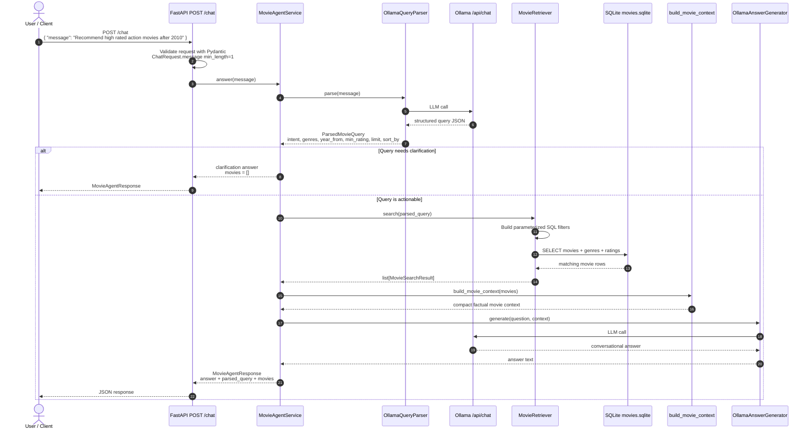

# Movie Agent API

FastAPI application for answering natural-language movie questions from a
local TMDB movie database. The app parses the user request with a local
Ollama-compatible LLM endpoint, retrieves matching movies from SQLite, then
uses the same endpoint to generate the final response.

## Before You Start

This project uses `uv` for Python package management. If `uv` is not installed,
follow the installation guide below first, then restart your terminal.

## Development

Install the development environment:

```powershell
uv sync --dev
```

Install the Git hooks:

```powershell
uv run pre-commit install --install-hooks
uv run pre-commit install --hook-type commit-msg
```

Run all checks manually:

```powershell
uv run pre-commit run --all-files
```

Run unit tests:

```powershell
uv run pytest
```

The pre-commit hook formats Python files with Ruff, applies safe Ruff fixes,
checks Python syntax, runs unit tests with Pytest, scans for secrets with
detect-secrets, and lints YAML and Markdown files. The commit-msg hook validates
commit messages with Commitizen conventional commits, for example:

```text
feat: add challenge parser
fix: handle empty input
docs: describe setup
```

## Architecture

The application follows a structured-retrieval-plus-LLM architecture.

At startup, the FastAPI application loads runtime configuration from `config/app.json`
and exposes the `/chat` endpoint. Before running the API, the offline setup script
loads the TMDB 5000 CSV files into a local SQLite database.


For each chat request, the system executes the following pipeline:

1. The client sends a natural-language movie question to `POST /chat`.
2. `OllamaQueryParser` sends the message to the local Ollama chat API and converts it
   into a validated `ParsedMovieQuery`.
3. `MovieRetriever` translates the structured query into deterministic, parameterized
   SQLite queries.
4. The retrieved movie rows are converted into a compact factual context.
5. `OllamaAnswerGenerator` sends the original question and retrieved context to Ollama
   and generates the final conversational response.
6. The API returns the final answer, the parsed query, and the retrieved movie records.

The LLM is deliberately not allowed to generate SQL. It only produces a structured
query object and later turns retrieved database facts into a user-friendly answer.

## Data Setup

The project uses the
[TMDB 5000 Movie Dataset](https://www.kaggle.com/datasets/tmdb/tmdb-movie-metadata)
from Kaggle. The expected source files are:

```text
data/tmdb_5000_movies.csv
data/tmdb_5000_credits.csv
```

Download the dataset with the helper script. By default it uses the Kaggle
dataset slug `tmdb/tmdb-movie-metadata` through the Python `kagglehub` package:

```powershell
uv run python scripts/download_data.py
```

If you already have a ZIP URL that contains the two CSV files, you can use it
instead:

```powershell
uv run python scripts/download_data.py --zip-url "https://example.com/dataset.zip"
```

You can also place the CSV files into `data/` manually.

## Generate Local Data

After downloading the CSV files, generate the local SQLite database:

```powershell
uv run python scripts/setup_data.py --force
```

The setup script reads `data/tmdb_5000_movies.csv` and
`data/tmdb_5000_credits.csv`, then creates `data/movies.sqlite`.

The generated database contains:

- `movies`: TMDB id, title, release year, overview, main cast, and director
- `genres`: normalized genre records
- `movie_genres`: many-to-many movie and genre links
- `ratings`: vote average and vote count for each movie

By default the script stores the first five cast members per movie. Override it
with `--cast-limit`:

```powershell
uv run python scripts/setup_data.py --force --cast-limit 8
```

To write the database somewhere else:

```powershell
uv run python scripts/setup_data.py --database data/custom_movies.sqlite --force
```

## LLM Endpoint

The application calls the Ollama chat API endpoint:

```text
POST http://localhost:11434/api/chat
```

Official endpoint documentation:
[Ollama chat API](https://docs.ollama.com/api/chat).

The code uses this endpoint twice for each chat request:

1. `OllamaQueryParser` converts the user's message into a structured movie
   query.
2. `OllamaAnswerGenerator` turns the retrieved movie context into the final
   natural-language answer.

The default model is configured in `config/app.json`. If you want to use a
Llama model, pull it in Ollama and set `ollama.model` to that model name, for
example:

```powershell
ollama pull llama3.1:8b
```

Then update:

```json
{
  "ollama": {
    "model": "llama3.1:8b",
    "base_url": "http://localhost:11434",
    "timeout_seconds": 300.0
  }
}
```

## Configuration

Runtime configuration lives in `config/app.json`:

```json
{
  "app": {
    "title": "Movie Agent API",
    "root_message": "Movie Agent API is running. Open /docs to try the API."
  },
  "database": {
    "path": "data/movies.sqlite"
  },
  "ollama": {
    "model": "gemma4:e2b",
    "base_url": "http://localhost:11434",
    "timeout_seconds": 300.0
  },
  "logging": {
    "level": "INFO",
    "file": "logs/app.log"
  }
}
```

Config fields:

- `app.title`: FastAPI application title shown in OpenAPI docs
- `app.root_message`: response returned by `GET /`
- `database.path`: SQLite database file used by the API
- `ollama.model`: local model name sent to Ollama
- `ollama.base_url`: Ollama server URL without the `/api/chat` suffix
- `ollama.timeout_seconds`: HTTP timeout for LLM calls
- `logging.level`: console and file log level
- `logging.file`: application log file path

Relative paths are resolved from the project root. To use a different config
file, set `MOVIE_AGENT_CONFIG` before starting the API:

```powershell
Set-Item Env:MOVIE_AGENT_CONFIG "config/local.app.json"
```

## Run The API

Start Ollama first and make sure the configured model is available:

```powershell
ollama serve
ollama pull llama3.1:8b
```

If you keep the default model in `config/app.json`, pull that model instead.

Start FastAPI with Uvicorn:

```powershell
uv run uvicorn main:app --app-dir src --reload
```

The API is then available at:

```text
http://127.0.0.1:8000
```

Useful endpoints:

- `GET /`: health-style root message
- `GET /docs`: interactive Swagger UI
- `POST /chat`: natural-language movie chat endpoint

Example request:

```powershell
Invoke-RestMethod `
  -Method Post `
  -Uri "http://127.0.0.1:8000/chat" `
  -ContentType "application/json" `
  -Body '{"message":"Recommend high rated action movies after 2010"}'
```

## Logs

Logs are written to both the console and the file configured in
`config/app.json`. The default file is:

```text
logs/app.log
```

The file logger uses rotation with a maximum file size of 5 MB and keeps three
backup files. Uvicorn access logs and application logs both go through the same
logging configuration.

## Future Improvements

- Add CI/CD checks for formatting, linting, type checking, unit tests, and integration tests.
- Add lightweight response quality checks for groundedness, hallucination prevention, fallback behavior, and retrieval relevance.
- Use a small golden test set with representative movie questions to validate retrieval and response quality.
- Improve error handling for invalid requests, empty results, database errors, LLM failures, and timeouts.
- Introduce asynchronous queue processing for slower LLM calls or batch tasks using Celery, RQ, or FastAPI-compatible background workers.
- Store anonymized chat logs, retrieved context, latency, and error metadata for debugging and quality improvement, with data minimization and limited retention.
- Improve ranking beyond deterministic SQL sorting. Currently, results are ordered mainly by rating, vote count, year, or title. A future version could add semantic similarity or a lightweight reranker to improve result relevance.
- Add better fallback responses when the system does not have enough data to answer confidently.

## Install uv

On Windows PowerShell:

```powershell
powershell -ExecutionPolicy ByPass -c "irm https://astral.sh/uv/install.ps1 | iex"
```

On macOS or Linux:

```sh
curl -LsSf https://astral.sh/uv/install.sh | sh
```

Then restart your terminal and check the installation:

```powershell
uv --version
```
